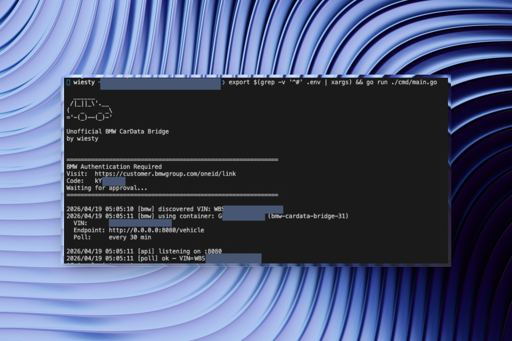

# Wiestys BMW CarData Bridge

A minimal local REST bridge for the [BMW CarData API](https://bmw-cardata.bmwgroup.com/customer/public/api-documentation). Exposes vehicle telemetry as a simple HTTP endpoint.



---

## Endpoints

| Endpoint | Description |
|----------|-------------|
| `GET /vehicle` | All available vehicle telemetry (see below) |
| `GET /health` | Service status + last poll timestamp |
| `GET /docs` | Swagger UI |
| `GET /openapi.json` | OpenAPI 3.0 spec |

---

## `/vehicle` Response

All fields except `mileage_km` and `last_update` are optional — they're omitted when not supported by your vehicle.

Example: ICE (combustion engine)
```json
{
  "mileage_km": 45000,
  "last_update": "2026-04-19T12:00:00Z",
  "range_km": 520,
  "range_fuel_km": 520,
  "fuel_level_pct": 78,
  "fuel_level_liters": 46.8,
  "is_moving": false,
  "is_ignition_on": false,
  "is_engine_on": false,
  "doors_locked": "LOCKED",
  "doors_status": "CLOSED",
  "trunk_open": false,
  "service_distance_km": 12000
}
```

Example: BEV (full electric)
```json
{
  "mileage_km": 45000,
  "last_update": "2026-04-19T12:00:00Z",
  "range_km": 520,
  "range_fuel_km": 520,
  "fuel_level_pct": 78,
  "fuel_level_liters": 46.8,
  "is_moving": false,
  "is_ignition_on": false,
  "is_engine_on": false,
  "doors_locked": "LOCKED",
  "doors_status": "CLOSED",
  "trunk_open": false,
  "service_distance_km": 12000
}
```

| Field | Unit | Vehicle types |
|-------|------|---------------|
| `mileage_km` | km | All |
| `range_km` | km | All (best available) |
| `range_electric_km` | km | BEV, PHEV |
| `range_fuel_km` | km | ICE, PHEV |
| `battery_soc_pct` | % | BEV, PHEV |
| `battery_soc_target_pct` | % | BEV, PHEV |
| `charging_status` | string | BEV, PHEV |
| `charging_power_kw` | kW | BEV, PHEV |
| `charging_time_remaining_min` | min | BEV, PHEV |
| `is_plugged_in` | bool | BEV, PHEV |
| `fuel_level_pct` | % | ICE, PHEV |
| `fuel_level_liters` | l | ICE, PHEV |
| `is_moving` / `is_ignition_on` / `is_engine_on` | bool | All |
| `doors_locked` / `doors_status` | string | All |
| `door_*_open` / `trunk_open` / `hood_open` | bool | All |
| `lights_on` | bool | All |
| `tire_pressure_*_kpa` | kPa | All |
| `tire_diagnosis` | string | All |
| `service_distance_km` | km | All |
| `check_control_messages` | string | All |

---

## Setup

### 1. Get a BMW Client ID

1. Log in at [bmw-cardata.bmwgroup.com](https://bmw-cardata.bmwgroup.com)
2. Go to **Technical Configuration → CarData API**
3. Create a client and copy the **Client ID**

or

1. Login into your BMW Account 
2. Go to your [vehicle](https://www.bmw.de/de-de/mybmw/vehicle-overview?icp=navi_ocpflyout_garage)
3. Select BMW CarData
4. Activate Technical access to BMW CarData and select both checkmarks
5. Copy Client ID

### 2. Run with Docker

**Option A — docker compose** (edit `docker-compose.yml` once, then):

```bash
docker compose up -d
```

**Option B — one-liner** (no file editing needed):

```bash
docker run -d \
  --name bmw-cardata-bridge \
  --restart unless-stopped \
  -e BMW_CLIENT_ID=your-client-id-here \
  -e POLL_INTERVAL_MINUTES=30 \
  -p 8080:8080 \
  -v /path/to/local/data:/data \
  ghcr.io/wiesty/bmw-cardata-bridge:latest
```
---

## Environment Variables

| Variable | Default | Description |
|----------|---------|-------------|
| `BMW_CLIENT_ID` | — | **Required.** From BMW CarData portal |
| `REST_PORT` | `8080` | HTTP server port |
| `POLL_INTERVAL_MINUTES` | `30` | Poll interval (min: 10) |
| `DATA_DIR` | `/data` | Directory for token + state files |

## Rate Limits

50 calls/24h. All ~30 descriptors are fetched in **one** API call per interval — adding more descriptors has no rate-limit cost. Default 30 min = 48 calls/day.

## Persistence

| File | Contents |
|------|----------|
| `$DATA_DIR/session.json` | OAuth tokens (auto-refreshed) |
| `$DATA_DIR/state.json` | Discovered VIN + container ID |

> If you want to change the descriptor set, delete `state.json` to force container recreation on next start.


On first start, the container prints an auth URL to stdout:

```
============================================================
BMW Authentication Required
Visit:  https://customer.bmwgroup.com/...
Code:   ABCD-1234
Waiting for approval...
============================================================
```

Open the URL, enter the code, confirm — done. Tokens are persisted to the Docker volume and refreshed automatically on restart.

### 3. Run locally (development)

```bash
export BMW_CLIENT_ID=your-client-id-here
export DATA_DIR=/tmp/bmw-data
mkdir -p $DATA_DIR
go run ./cmd/main.go
```

---

## GitHub Actions

Pushes to `main` build and publish a multi-platform image (`amd64` + `arm64`) to:

```
ghcr.io/wiesty/bmw-cardata-bridge:latest
```

---


Inspired by the BMW CarData API research in [tjamet/bmw-cardata](https://github.com/tjamet/bmw-cardata). This project is a complete stdlib-only reimplementation with persistent state, restart-aware polling, and a REST layer.

## License

[Apache 2.0](LICENSE) — this project is not affiliated with or endorsed by BMW Group.
